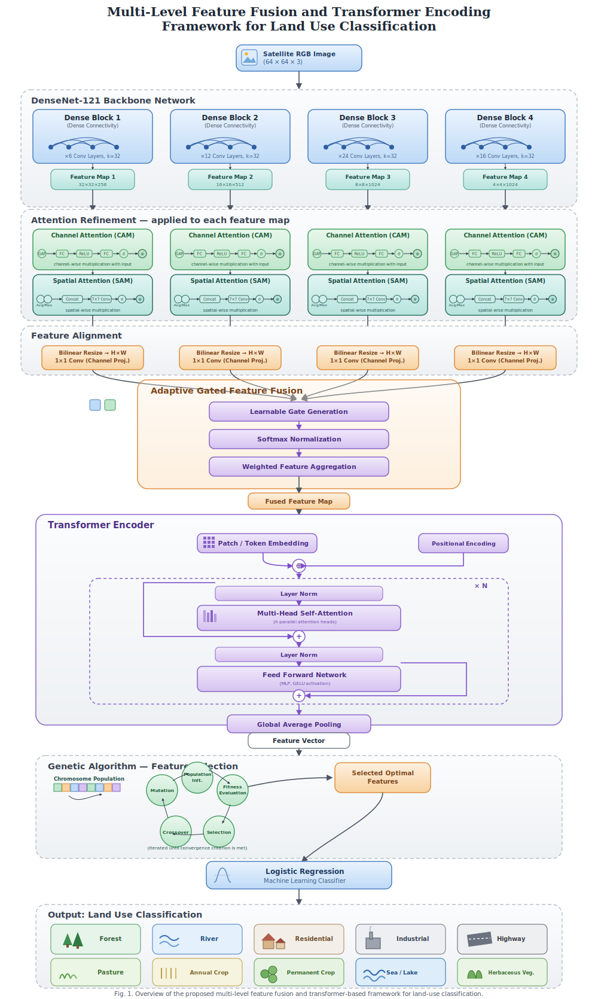

# 🌍 Multi-Scale Feature Fusion & Transformer Encoding for EuroSAT Land Use Classification

<p align="center">
  
</p>

<p align="center">


</p>

---

## 🏆 Research Highlights

- 🥇 **Best Paper Award** — ICAIATI 2025
- 📄 Accepted for publication in **Taylor & Francis**
- 🚀 Achieved **97.36% Test Accuracy** on EuroSAT
- 🛰️ Proposed a novel **Multi-Level Feature Fusion Transformer (MLFT)** framework
- 🧬 Genetic Algorithm based Feature Selection
- 🤖 Transformer-based Contextual Learning

---

## 📄 Resources

📑 **Conference Paper**

➡️ [EuroSAT_Conference.pdf](EuroSAT_Conference.pdf)


📂 **Dataset**

https://www.kaggle.com/datasets/raoofnaushad/eurosat-sentinel2-dataset

---

# 📖 Overview

Land Use and Land Cover (LULC) classification plays a crucial role in environmental monitoring, precision agriculture, urban planning, disaster management, and remote sensing applications.

This repository presents the implementation of our proposed **Multi-Level Feature Fusion Transformer (MLFT)** architecture, which combines multi-scale convolutional feature extraction, attention mechanisms, transformer encoding, and evolutionary feature optimization to improve satellite image classification.

The proposed framework achieved a **97.36% test accuracy**, outperforming several state-of-the-art CNN architectures on the EuroSAT benchmark dataset.

---

# 🎯 Applications

- 🌾 Precision Agriculture
- 🏙 Urban Planning
- 🌍 Land Cover Mapping
- 🌳 Environmental Monitoring
- 🌊 Water Resource Analysis
- 🚨 Disaster Assessment
- 🛰 Remote Sensing

---

# 📂 Dataset

**EuroSAT RGB Dataset**

| Property | Value |
|----------|-------|
| Images | 27,000 |
| Classes | 10 |
| Resolution | 64 × 64 |
| Satellite | Sentinel-2 |

### Classes

- AnnualCrop
- Forest
- HerbaceousVegetation
- Highway
- Industrial
- Pasture
- PermanentCrop
- Residential
- River
- SeaLake

---

# 🏗 Proposed Architecture

The proposed **MLFT** architecture integrates DenseNet feature extraction, attention-based refinement, transformer encoding, and genetic algorithm optimization.

<p align="center">

</p>

<p align="center">
<b>Figure.</b> Proposed Multi-Level Feature Fusion Transformer (MLFT) Architecture.
</p>

---

# ⚙ Methodology

```text
Satellite Image
        │
        ▼
DenseNet-121
        │
        ▼
Channel Attention
        │
        ▼
Spatial Attention
        │
        ▼
Adaptive Gated Fusion
        │
        ▼
Transformer Encoder
        │
        ▼
Global Average Pooling
        │
        ▼
Genetic Algorithm
        │
        ▼
Logistic Regression
        │
        ▼
Land Use Prediction
```

---

# 🧠 Model Components

| Module | Purpose |
|---------|---------|
| DenseNet-121 | Multi-scale Feature Extraction |
| Channel Attention | Channel Refinement |
| Spatial Attention | Spatial Feature Enhancement |
| Adaptive Gated Fusion | Multi-Level Feature Fusion |
| Transformer Encoder | Global Context Modeling |
| Genetic Algorithm | Feature Selection |
| Logistic Regression | Final Classification |

---

# ⚙ Experimental Setup

| Parameter | Value |
|-----------|-------|
| Training | 70% |
| Validation | 15% |
| Testing | 15% |
| Dataset | EuroSAT RGB |
| Image Size | 64 × 64 |

---

# 📊 Performance Comparison

The proposed **MLFT (Multi-Level Feature Fusion Transformer)** framework was compared against several state-of-the-art CNN backbones on the EuroSAT dataset using a **70/15/15 train–validation–test split**.

| CNN Backbone | Classifier | Validation Accuracy (%) | Test Accuracy (%) |
|--------------|------------|------------------------:|------------------:|
| ResNet-50 | Logistic Regression | 96.17 | 95.90 |
| DenseNet-121 | Logistic Regression | 96.89 | 96.77 |
| EfficientNet-B0 | Logistic Regression | 95.51 | 95.73 |
| MobileNet-V2 | SVM | 93.29 | 93.88 |
| AlexNet | SVM | 91.88 | 91.95 |
| ⭐ **Fusion + Transformer + GA + LR (Proposed)** | Logistic Regression | **97.41** | **97.36** |

### Key Findings

- 🚀 The proposed **Fusion + Transformer + GA + LR** framework achieved the **highest validation accuracy (97.41%)**.
- 🏆 It also obtained the **best test accuracy (97.36%)**, outperforming all baseline CNN models.
- 🎯 Multi-level feature fusion, transformer-based contextual learning, and genetic algorithm-based feature selection significantly improved classification performance.

---

# 📂 Repository Structure

```text
EuroSAT-LULC-Classification
│
├── README.md
├── EuroSAT_Conference.pdf
├── ARCHITECTURE.pdf
├── architecture_diagram.svg
└── OIML_CT_1.ipynb
```

---

# 📒 Notebook

The implementation of the proposed framework is available in

```
OIML_CT_1.ipynb
```

---

# 🚀 Future Work

- Vision Transformers (ViT)
- Swin Transformers
- Self-Supervised Learning
- Explainable AI (Grad-CAM)
- Lightweight Deployment
- Multi-Spectral Sentinel-2 Processing
- Real-Time Remote Sensing Applications

---

# 👨‍💻 Author

**Jaswanth Yadurla**

B.Tech — Artificial Intelligence & Machine Learning

📧 yadurlajaswanth@gmail.com

🔗 LinkedIn: https://www.linkedin.com/in/jaswanth-yadurla-634290284/

---


# 🙏 Acknowledgements

- ICAIATI 2025
- Taylor & Francis
- EuroSAT Dataset
- Sentinel-2 Mission
- Chaitanya Bharathi Institute of Technology (CBIT)

---

<p align="center">

⭐ If you found this work useful, please consider giving the repository a Star.

Made with ❤️ by **Jaswanth Yadurla**

</p>
